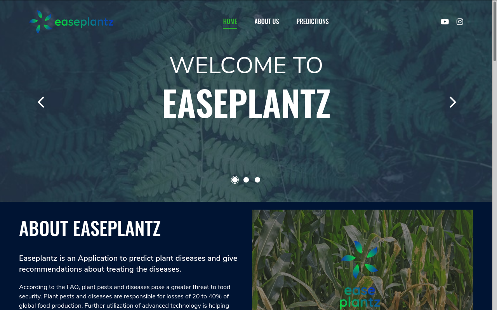
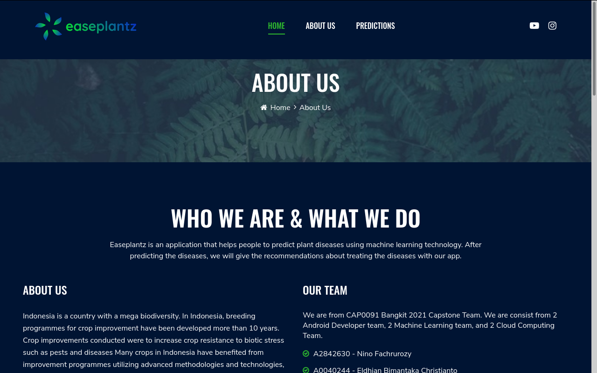
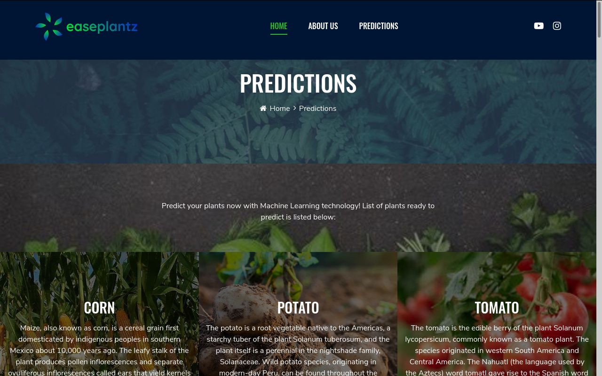

# Easeplantz Front-End Service

Easeplantz Front-End Service is a Service that provides a web application interface for online predictions and our profile website.
This project was bootstrapped with [Create React App](https://github.com/facebook/create-react-app).

For further explorations about our website, please visit [This Link.](https://www.easeplantz.ml)

<!-- MarkdownTOC levels="1,2,3" autolink="true"  -->
- [Overview](#overview)
- [List of Menu](#list-of-methods)
    - [Index](#index)
    - [About Us](#about-us)
    - [Prediction Service](#prediction-service)
- [Contributor](#contributor)
<!-- /MarkdownTOC -->

# Overview
This Frontend Service has three main service installed on it:

- **Index**: Service for displaying main webpage in Easeplantz Front-end service.
- **About Us**: Service that displaying about-us page and our team profile.
- **Prediction Services**: Services to predict plant diseases instantly by uploading the images on the web application.

## List of Menu
Here are the details of the Front-end services displayed on the easeplantz websites:

### Index
This Index page displays the home page, the carousel picture, summary of our services and list of predicted plants in summary.

### About Us
This About Us page displays about our team profile, and the reasons behind the Easeplantz project in summary.

### Prediction Service
The Prediction service page displays all of the predicted plants histories. This page has three sub-pages: corn prediction, potato prediction, and tomato prediction. each of these sub-pages corresponds on their plant diseases prediction services.

## Contributor
This Easeplantz Backend Repository was a part of the Easeplantz Capstone Project from Bangkit Academy 2021 Program. Please welcome the contributors of this project:

- [A2842630 - Nino Fachrurozy](https://github.com/nfach98)
- [A0040244 - Eldhian Bimantaka Christianto](https://github.com/Eldhianbmntaka)
- [C1801846 - Sablina Damayanti](https://github.com/sablinadamayanti)
- [C1031406 - Geraldhi Aditya Putra Mahayadnya](https://github.com/gerald-apm)
- [M0040333 - Dympna Tinezsia Adhisti](https://github.com/dhiisti)
- [M0040318 - Mpu Hambyah Syah Bagaskara Aji](https://github.com/mpuhambyah)

Easeplantz Project 2021. All rights reserved.